# 3scale OSSM v2.1 WASM Tutorial

The following tutorial steps through provisioning and configuration for API management using 3scale in the context of services deployed to a Service Mesh.

## Prerequisites

The following assumptions are made about the target environment:

- OpenShift version 4.8+
- At least 3 worker nodes
- Appropriate Red Hat software subscriptions

## Provision OpenShift Data Foundation

Install the OpenShift Container Storage Operator into the recommended namespace `openshift-storage`.

Label nodes where OpenShift Container Storage should be hosted. If all worker nodes should be used, the following command can be used to label them.

```
for node in $(oc get node -l node-role.kubernetes.io/worker -o name); do oc label ${node} cluster.ocs.openshift.io/openshift-storage=""; done
```

Apply the StorageCluster:

```
oc apply -f openshift-storage/StorageCluster_ocs-storagecluster.yaml -n openshift-storage
```

3scale requires a RWX storage class. The storage class used by the 3scale control plane will be `ocs-storagecluster-cephfs`. Ensure that the storage class is available with the following command.

```
oc get storageclasses
```

## Provision 3scale

Install 3scale operator into `3scale` namespace. (Create new namespace)

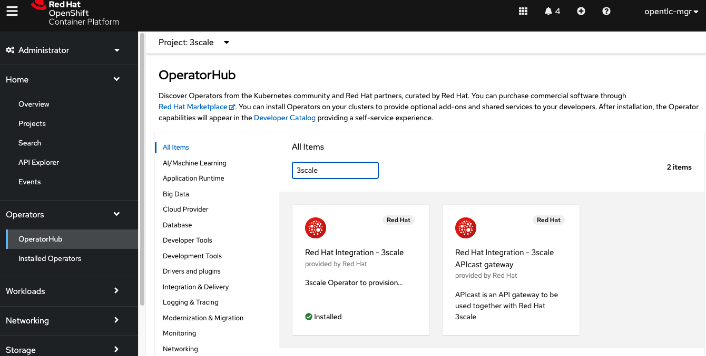

Set the cluster wildcard domain in `3scale/APIManager_3scale.yaml`

Example wildcard domain: `apps.cluster-8glcz.8glcz.sandbox730.opentlc.com`

```
oc apply -f 3scale/APIManager_3scale.yaml -n 3scale
```

You should see a screen like this:

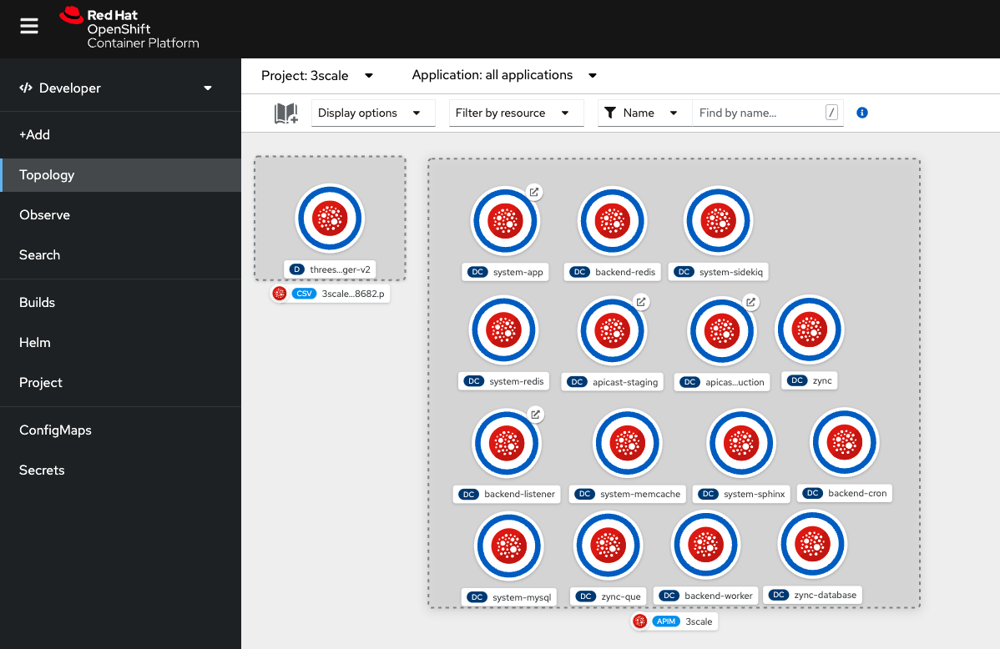

## Provision OpenShift Service Mesh

1. Install Elasticsearch operator all namespaces
2. Install Jaeger operator all namespaces
3. Install Kiali operator all namespaces
4. Install OpenShift Service Mesh operator all namespaces

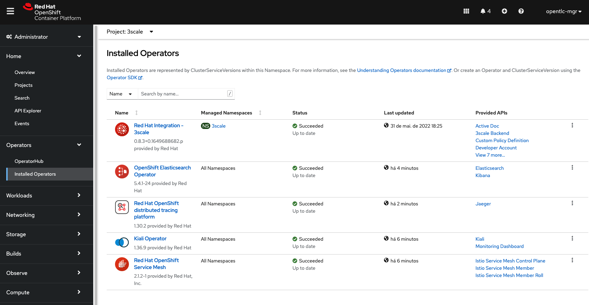

5. Create a namespace for the service mesh control plane
6. Provision a control plane (see below)

```
oc new-project istio-system
oc apply -f istio-system/ServiceMeshControlPlane_basic.yaml -n istio-system
```

You should see a screen like this:

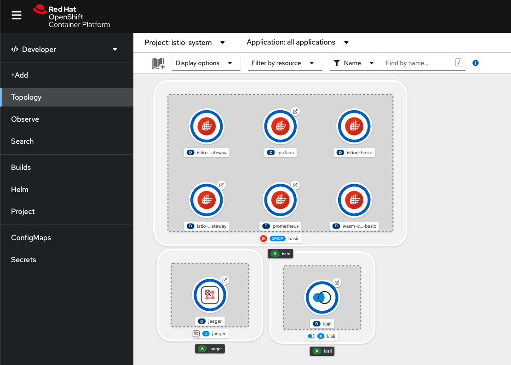

## Provision BookInfo demo

### Deploy BookInfo

Create a new project and include `bookinfo` in the service mesh.

```
oc new-project bookinfo
oc apply -f istio-system/ServiceMeshMemberRoll_default.yaml -n istio-system
```

Provision the bookinfo application.

```
oc apply -f https://raw.githubusercontent.com/maistra/istio/maistra-2.1/samples/bookinfo/platform/kube/bookinfo.yaml -n bookinfo
oc apply -f https://raw.githubusercontent.com/maistra/istio/maistra-2.1/samples/bookinfo/networking/bookinfo-gateway.yaml -n bookinfo
```

You should see a screen like this:

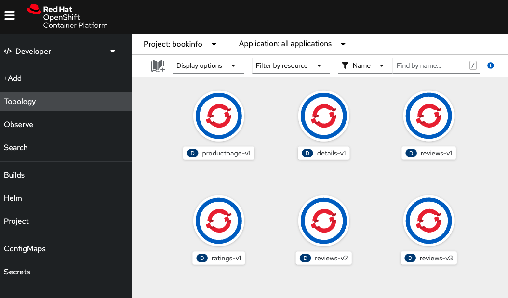


You can now verify that the bookinfo service is responding:

```
curl -v http://istio-ingressgateway-istio-system.{cluster wildcard url}/productpage
```

You should see `200` as HTTP code.

### Configure BookInfo 3scale Product

Log into 3scale using the route whose hostname begins with `3scale-admin` in the `3scale` namespace.

NOTE: You will find the admin username and password in a secret called `system-seed` in the `3scale` namespace.

1. Create a new Product and give it any name
2. Go to Integration->Settings and choose `Istio` as the deployment
3. Go to Integration->Configuration and Promote the config
4. Go to Overview and create an application plan
5. Go to Applications->Application Plans and publish the application plan
6. Go to the Product Overview and take note of the ID given to the API (This will be used in later steps)

### Enable API Policy Management for BookInfo

#### Configure 3scale URLs

Find the URLs for the 3scale-admin and backend-3scale routes in the `3scale` namespace. Substitute those URLs into the ServiceEntry resources (Line 7).

```
  - system-provider.3scale.svc.cluster.local
```

and 

```
  - backend-listener.3scale.svc.cluster.local
```

Apply the configuration:

```
oc apply -f bookinfo/ServiceEntry_system-entry.yaml -f bookinfo/ServiceEntry_backend-entry.yaml -n bookinfo
```

#### Configure system token

Copy the `ADMIN_ACCESS_TOKEN` key of the `system-seed` secret in the `3scale` namespace and replace the value of `spec.config.system.token` (Line 16) in `bookinfo/ServiceMeshExtension_bookinfo.yaml`

#### Configure service

Use 3scale admin access token along with the 3scale product ID from the 3scale product configuration and run the following command with values replaced:

```
curl https://3scale-admin.{cluster wildcard url}/admin/api/services/{product id}/proxy/configs/production/latest.json?access_token={access token} | jq '.proxy_config.content.backend_authentication_value'
```

The output will be the service token. Modify the `id` and `token` of the `spec.config.services` (line 33) entry in `bookinfo/ServiceMeshExtension_bookinfo.yaml`. The `id` value should be the product ID.

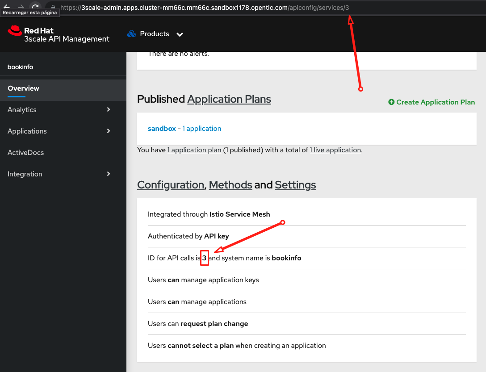

#### Apply extension

```
oc apply -f bookinfo/ServiceMeshExtension_bookinfo.yaml -n bookinfo
```

### Authorize an Application to Consume the API

1. In 3scale, go to the Product overview
2. Select `Applications > Listing` in the side menu
3. Click on `Create Application` in the top right corner

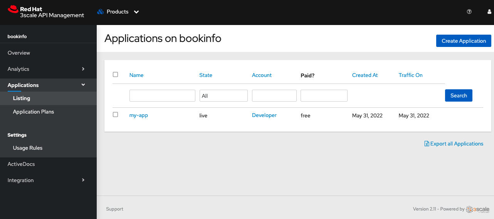

2. Fill the form and create the application

You should now have an API key that you can copy and use for authorization

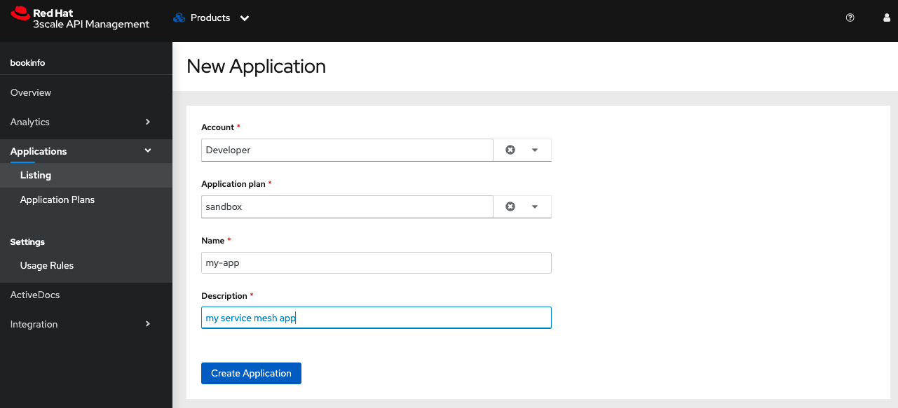

### Verify the policy enforcement

Access without credentials:

```
curl -v http://istio-ingressgateway-istio-system.{cluster wildcard url}/productpage`
```

You should see an HTTP 403 response.

Access with credentials (from the previous step):

```
curl -v http://istio-ingressgateway-istio-system.{cluster wildcard url}/productpage?user_key={user key}
```

You should see an HTTP 200 response.

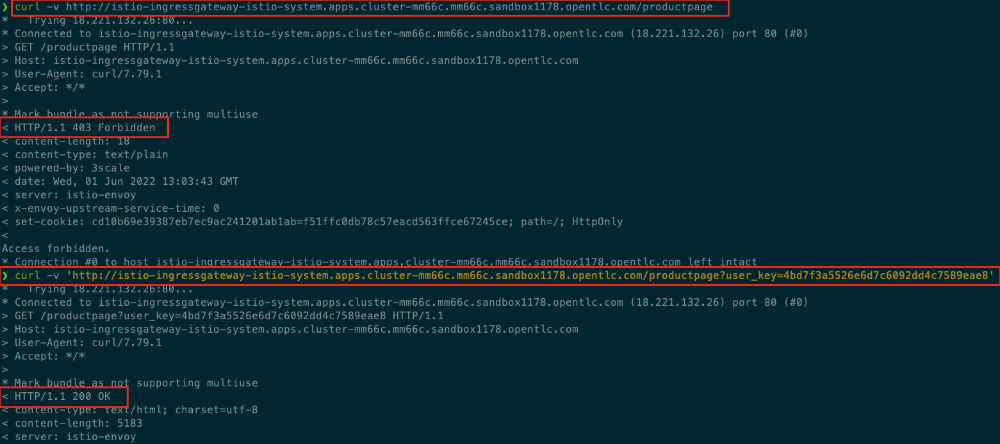

## Enable OIDC Authentication Flow

### Provision and configure Red Hat SSO

Install the Red Hat SSO operator into the `keycloak` namespace.

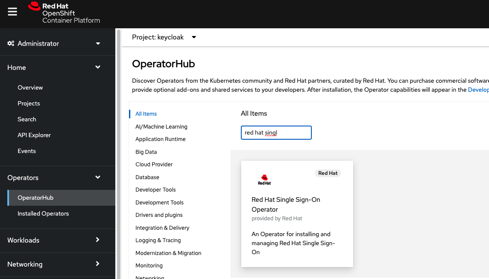

Provision an instance of Keycloak.

```
oc new-project keycloak
oc apply -f keycloak/Keycloak_keycloak.yaml -n keycloak
```

Wait for all pods to be in a running state.

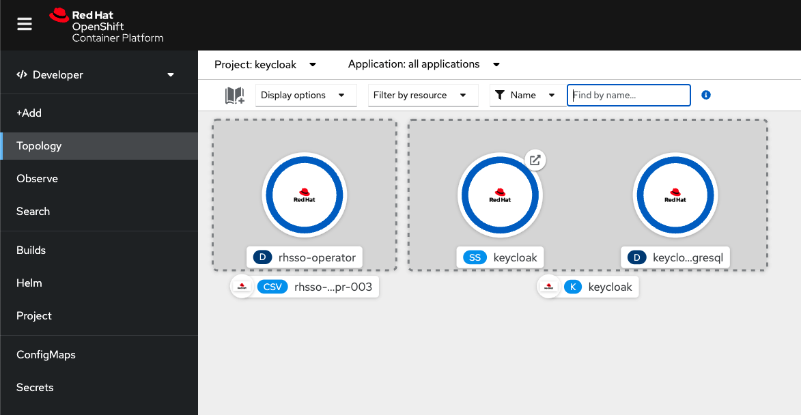

NOTE: The URL to the Keycloak admin console can be found by listing the routes in the `keycloak` namespace, and the administrator credentials can be found in the secret called `credential-keycloak`

### Keycloak Realm configuration

Apply the custom resources provided in this repository in order to leverage the Keycloak operator to create the realm, client, and user.

```
oc apply -f keycloak/ -n keycloak
```

[More info on the Keycloak operator](https://www.keycloak.org/docs/latest/server_installation/index.html#_operator)

At this time it is not possible to configure the necessary service account permissions with custom resources.

To add the permissions in the Red Hat SSO UI:

1. Log into RH SSO and select the `Threescale` realm.
2. Browse to `Clients` and select the `3scale-zync` client
3. Select the `Service Account Roles` tab
4. Select `realm-management` from the `Client Roles` dropdown
5. Select `manage-clients` from the `Available Roles` and add it to `Assigned Roles`

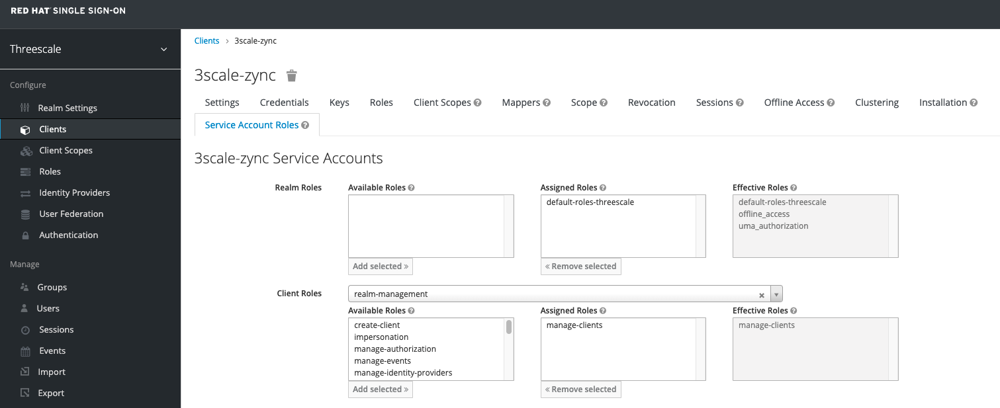

### Service Mesh OIDC Integration

#### Configure BookInfo 3scale Product with OIDC authentication

Log into 3scale using the route whose hostname begins with `3scale-admin` in the `3scale` namespace.

NOTE: You will find the admin username and password in a secret called `system-seed` in the `3scale` namespace.

1. Create a new Product and give it any name
2. Go to Integration->Settings and choose `Istio` as the deployment
3. Go to Integration->Authentication and choose `OpenID Connect Use OpenID Connect for any OAuth 2.0 flow.` as the authentication
4. Go to Integration->'OpendID Connect (OIDC) Basics' and enter `https://3scale-zync:zync-secret@{keycloak url}/auth/realms/threescale`. Keycloak URL can be obtained using
  ```
  oc get route keycloak -o jsonpath="{.spec.host}{.spec.path}" -n keycloak
  ```
5. Go to Integration->'OIDC Authorization Flow' and Select `Authorization Code Flow` and `Service Accounts Flow`. Click `Update Product` at the bottom of the screen
6. Go to Integration->Configuration and Promote the config
7. Go to Overview and create an application plan
8. Go to Applications->Application Plans and publish the application plan
9. Go to the Product Overview and take note of the ID given to the API by searching for text `ID for API calls is`(This will be used in later steps)

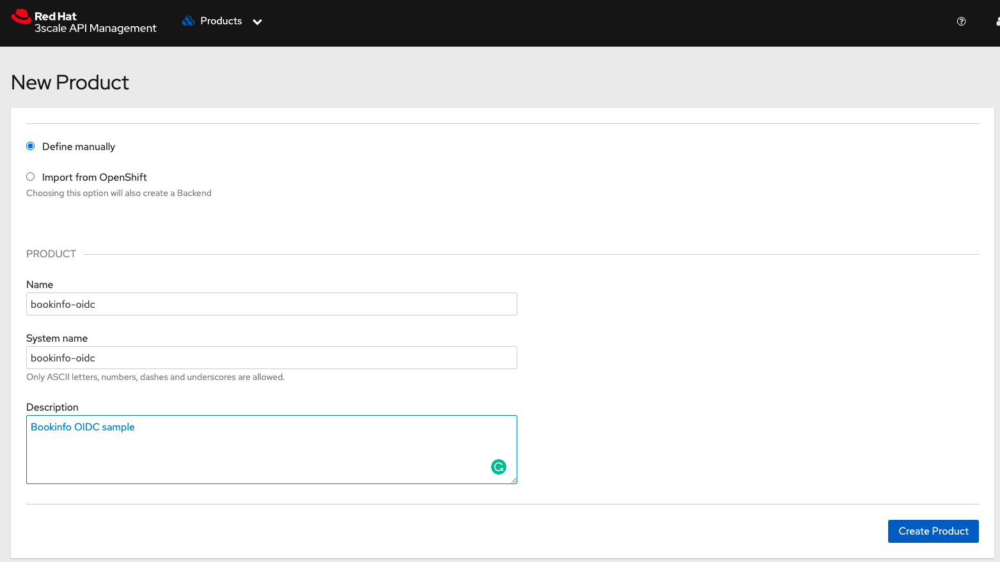

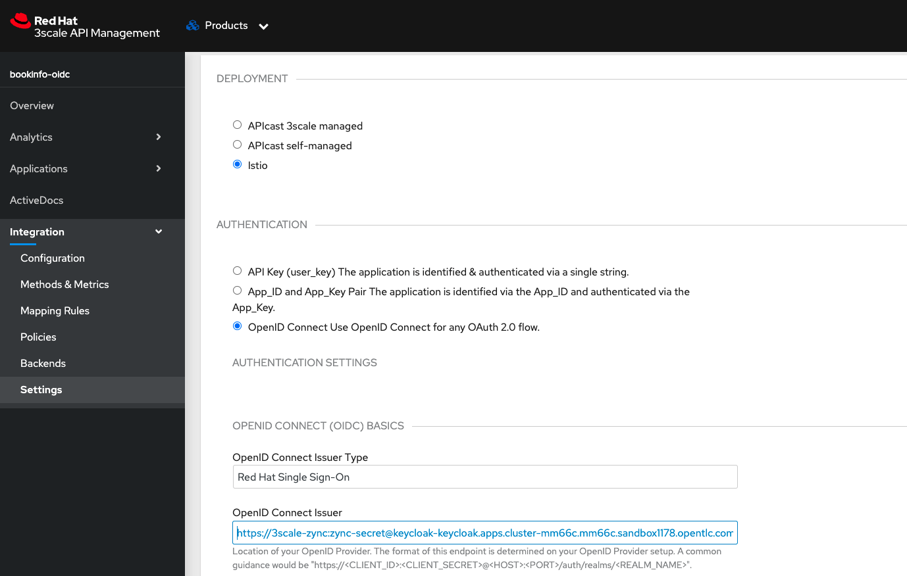

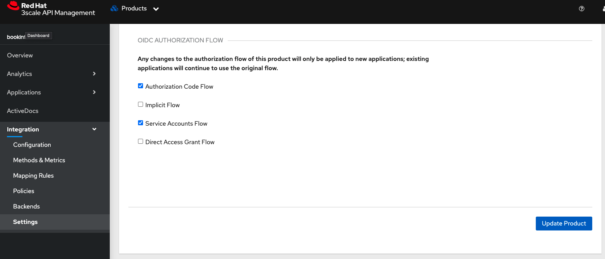

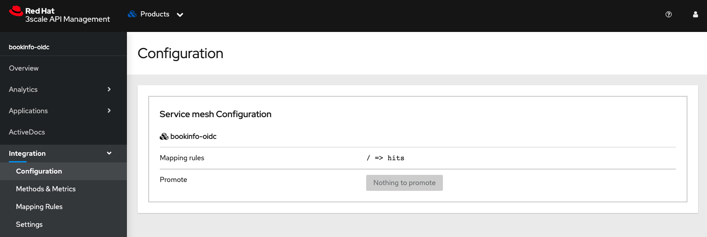

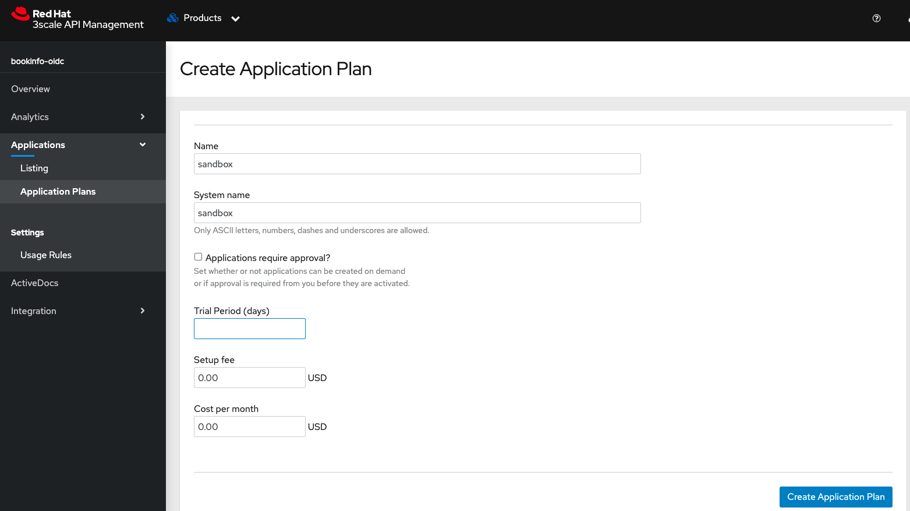

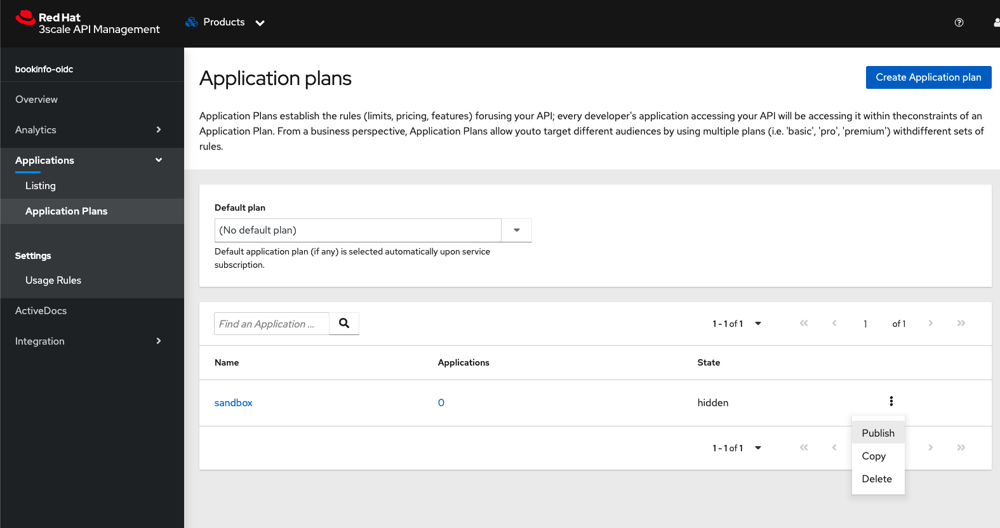

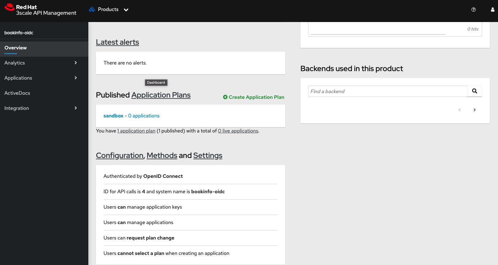

#### Enable API Policy Management for BookInfo

If the `Service Entry` for 3scale system-provider and backend are not created earlier then please perform the below step

##### Configure 3scale URLs
OSSM ServiceEntries for 3scale-admin and 3scale-backend uses OpenShift service URLs in the `3scale` namespace. So, please go ahead and apply them.

```
oc apply -f bookinfo/ServiceEntry_system-entry.yaml -f bookinfo/ServiceEntry_backend-entry.yaml -n bookinfo
```
##### Create Request Authentication

Request authentication when applied to OSSM will validate the `JWT` token and store the contents in an internal metadata object which will be used by the 3scale WASM module to validate against 3scale.

  ```
  oc get route keycloak -o jsonpath="{.spec.host}{.spec.path}" -n keycloak
  ```
Get the Keycloak URL as shown above, modify `RequestAuthentication_bookinfo-oidc.yaml` and apply

```
oc apply -f bookinfo/RequestAuthentication_bookinfo-oidc.yaml -n bookinfo
```
##### Configure system token

Copy the `ADMIN_ACCESS_TOKEN` key of the `system-seed` secret in the `3scale` namespace and replace the value of `spec.config.system.token` in `bookinfo/ServiceMeshExtension_bookinfo-oidc.yaml`

##### Configure service
Use 3scale admin access token along with the 3scale product ID from the 3scale product configuration and run the following command with values replaced:
```
curl https://3scale-admin.{cluster wildcard url}/admin/api/services/{product id}/proxy/configs/production/latest.json?access_token={access token} | jq '.proxy_config.content.backend_authentication_value'
```
The output will be the service token. Modify the `id` and `token` of the `spec.config.services` entry in `bookinfo/ServiceMeshExtension_bookinfo-oidc.yaml`. The `id` value should be the product ID.

##### Apply extension

3scale `app_id` for OIDC matches the OAuth's `client_id` typically found in the `azp` field of the `JWT` token. Here is how you can access `azp` 
```
      credentials:
        app_id:
          - filter:
              path:
                - envoy.filters.http.jwt_authn
                - "0"
              keys:
                - azp
              ops:
                - take:
                    head: 1
```
Please delete the `ServiceMeshExtension` if created before else ignore the step
```
oc delete sme bookinfo -n bookinfo
```
Apply the ServiceMesh Extension
```                   
oc apply -f bookinfo/ServiceMeshExtension_bookinfo-oidc.yaml -n bookinfo
```

##### Authorize an Application to Consume the API

1. In 3scale, go to Audience
2. Choose an account to authorize (you can use the default Developer account)
3. Follow the Link at the top of the page that says `N Applications` (N being the number of applications the account has)
4. Click Create Application
5. Select the target application plan and provide a name, then create
6. This is required to test `Authorization Code flow`. In the current page where application details are shown, under `API Credentials` section click `Edit` and apply(based on the version of the postman) either `https://oauth.pstmn.io/v1/callback` OR `https://www.getpostman.com/oauth2/callback` to the `Redirect URL`

You should now have the `Client ID` and `Client Secret`. This is needed to test `Client Credentials` and `Authorization Code` flows.

##### Verify the policy enforcement for Client Credentials flow
Access without credentials:
```
curl -v http://istio-ingressgateway-istio-system.{cluster wildcard url}/api/v1/products
```
You should see an HTTP 403 response.

Access with `JWT` token using `Client Credential flow` using the `Client ID` and `Client Secret` obtained in the previous step:

```
export SSO_CLIENT_ID=<Client ID>
export SSO_CLIENT_SECRET=<Client Secret>
export SSO_URL=<Keycloak URL>
export TKN=$(curl -k -X POST \
 -H "Content-Type: application/x-www-form-urlencoded" \
 -d "grant_type=client_credentials&client_id=$SSO_CLIENT_ID&client_secret=$SSO_CLIENT_SECRET" \
 https://$SSO_URL/auth/realms/threescale/protocol/openid-connect/token \
| sed 's/.*access_token":"//g' | sed 's/".*//g')

curl -v -H "Accept: application/json" -H "Authorization: Bearer $TKN" http://istio-ingressgateway-istio-system.{cluster wildcard url}/api/v1/products
```
You should see an HTTP 200 response.

##### Verify the policy enforcement for Authorization Code flow

Postman will be used to test this flow as it has to open the browser to capture the user credentials. So, please install postman if you do not have it and import the collection from `support/postman_collection.json`.

Upon importing change the `keycloak_url`, `istio-url`, `client_id`, `client_secret` collection variables as below

- keycloak-url: RH-SSO/Keycloak URL
- istio-url: istio-ingressgateway-istio-system.{cluster wildcard url}
- client_id : Client Id of the 3scale application 
- client_secret: Client Secret of the 3scale application

Open `OIDC-Bookinfo-OSSM-Auth Flow` request in postman, click `Authorization` tab, scroll down and click `Get New Access Token`. This will open the browser and asks for user credentials. Please enter `user1` and `openshift` as username and password. This will generate the JWT token. 

Click `Use this token` and Click `Send` for the request to be successful.
